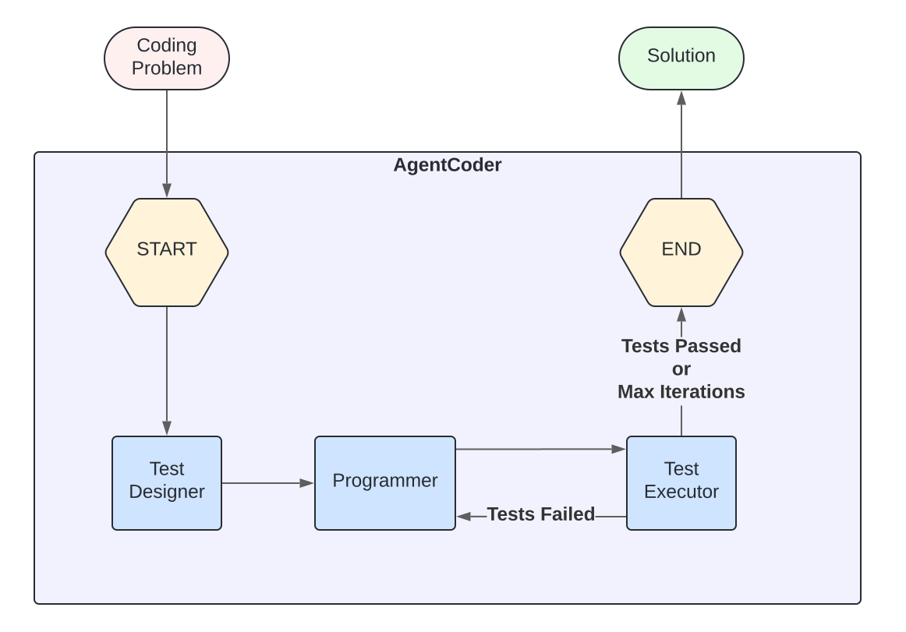
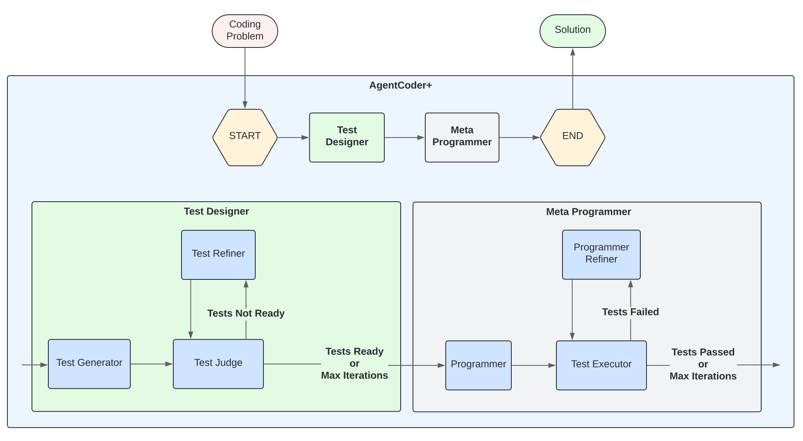
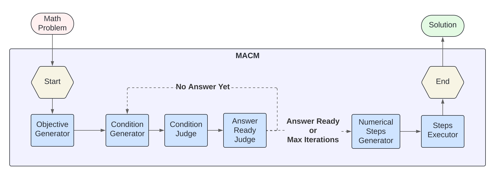
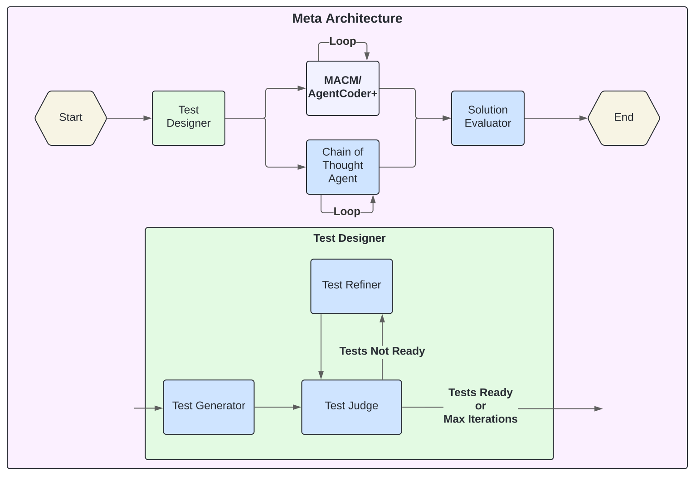

# SwarmGPT: Harnessing Collective Intelligence with Large Language Models

<p align="center">
  
  
  
  
</p>

<p align="center">
  <strong>Author:</strong> Pedro Urbina Rodriguez<br>
  <strong>Supervisors:</strong> <a href="https://www.doc.ic.ac.uk/~fbelard/">Dr Francesco Belardinelli</a>, <a href="https://www.doc.ic.ac.uk/~mpsha/">Professor Murray Shanahan</a><br>
  <strong>Submitted:</strong> September 2024<br>
  <strong>Grade:</strong> Distinction<br>
</p>

<p align="center">
  <em>Submitted in partial fulfillment of the requirements for the MSc degree in Advanced Computing of Imperial College London</em>
</p>

---

## Abstract

Large Language Models (LLMs) represent a significant step toward achieving Artificial General Intelligence (AGI). Despite their impressive problem-solving capabilities in text-based tasks, LLMs still face several limitations that hinder their broader adoption—including their tendency to hallucinate, limited reasoning abilities, and constraints on context window length.

To address these issues, the field of **multi-agent LLM frameworks** has emerged, integrating concepts from Multi-Agent Systems (MAS) with LLMs. This thesis provides an overview of the key developments leading to the rise of multi-agent LLMs and offers a categorization of existing frameworks in the field.

The primary contribution of this work is the introduction of a **meta-framework for multi-agent LLM systems**, designed to enhance frameworks tasked with solving problems that have verifiable solutions. Through rigorous testing, we demonstrate that this meta-framework consistently improves the performance of two multi-agent LLM frameworks across different domains: **mathematics** (MATH benchmark) and **coding** (HumanEval benchmark).

Lastly, we present a vision for the future of multi-agent LLMs, advocating for a shift toward the development of **LLM Organizations**. Drawing parallels with the evolution of MAS—where focus shifted from an agent-centered approach to an organization-centered approach by incorporating concepts from Organization Theory—we argue that similar advancements can lead to the creation of more capable and scalable LLM-based multi-agent systems.

---

## Key Features

### 🔬 Novel Multi-Agent Architectures
- **AgentCoder+**: Enhanced coding framework with iterative test refinement
- **MetaMACM**: Meta-framework applied to mathematical problem solving  
- **MetaAgentCoder+**: Meta-framework applied to code generation

### 📊 Empirical Validation
- Demonstrated improvements on **MATH** and **HumanEval** benchmarks
- GPT-4o with MetaMACM: **61.19%** accuracy (vs 57.14% baseline)
- GPT-4o-mini with MetaAgentCoder+: **92.07%** pass@1 (outperforming GPT-4o baseline)

### 🧠 Theoretical Contributions
- Comprehensive literature review of multi-agent LLM frameworks
- Vision for **LLM Organizations**: shifting from agent-centric to organization-centric design
- Integration of Organization Theory concepts (AGR, MOISE+, ORA4MAS) with modern LLMs

### 🛠️ Built With
- **LangChain** & **LangGraph** for multi-agent orchestration
- **OpenAI GPT-4o** & **GPT-4o-mini** models
- Python with modular, extensible architecture

---

## Acknowledgments

This research was made possible through the generous support of the **[OpenAI Researcher Access Program](https://openai.com/form/researcher-access-program/)**, which provided $1,000 in computing credits that enabled access to state-of-the-art LLM models. We extend our sincere gratitude to OpenAI for their commitment to supporting academic research.

Special thanks to:
- **[Dr Francesco Belardinelli](https://www.doc.ic.ac.uk/~fbelard/)** for agreeing to supervise this self-proposed project in the nascent research field of Multi-Agent Large Language Models
- **[Professor Murray Shanahan](https://www.doc.ic.ac.uk/~mpsha/)** for insightful discussions that planted the seeds for this research well before it started and for collaboration in the evaluation of this thesis

---

## Problem Statement

While LLMs represent a significant advance in the generality of AI systems, they still face substantial challenges:

| Challenge | Description |
|-----------|-------------|
| **Hallucinations** | LLMs are prone to generating incorrect or misleading information, especially when operating outside their training distribution, as their training objective is next-token prediction rather than ensuring factual accuracy |
| **Reasoning Abilities** | LLMs often struggle with tasks that require deep logical thinking and coherent multi-step reasoning |
| **Adaptive Compute** | Due to autoregressive token generation, LLMs use similar compute regardless of task complexity—unlike humans who spend more effort on difficult problems |
| **Context Window Length** | LLM performance degrades as prompts grow longer; simply increasing context window size is not a sufficient solution |
| **Effective Cooperation** | Enabling effective cooperation between multiple LLM agents remains an open challenge |

### How Multi-Agent LLMs Address These Challenges

| Challenge | Multi-Agent Solution |
|-----------|---------------------|
| **Hallucinations** | Error-correction, refinement, and voting mechanisms among agents to cross-verify information |
| **Reasoning Abilities** | Decompose complex problems into smaller subproblems that individual agents can tackle step-by-step |
| **Adaptive Compute** | Breaking down problems across multiple agents implicitly allocates more resources to harder problems |
| **Context Window** | Distributed representation across agents reduces context required by each individual agent |

---

## Implemented Frameworks

### AgentCoder (Baseline)

The original [AgentCoder](https://arxiv.org/abs/2312.13010) architecture consists of three agents:

<p align="center">
  
</p>

**Limitation**: Test cases are generated only once. Erroneous tests hinder the code refinement process.

---

### AgentCoder+ (Our Enhancement)

AgentCoder+ introduces an **iterative test refinement loop** before code generation:

<p align="center">
  
</p>

**Key Innovation**: The Test Judge assesses test correctness; if errors are detected, the Test Refiner improves them before code generation begins.

---

### MACM (Baseline for Mathematics)

The [Multi-Agent System for Conditional Mining](https://arxiv.org/abs/2404.04735) (MACM) solves mathematical problems by iteratively building conditions (lemmas) until a solution is reached:

<p align="center">
  
</p>

| Agent | Role |
|-------|------|
| **Objective Generator** | Extracts the primary goal and initial conditions from the problem |
| **Condition Generator** | Proposes new conditions/lemmas at each iteration |
| **Condition Judge** | Validates proposed conditions for correctness |
| **Answer Ready Judge** | Determines if conditions provide a complete path to the answer |
| **Numerical Steps Generator** | Plans the calculation steps needed for the solution |
| **Steps Executor** | Executes calculations using a code interpreter |

---

### Meta-Framework Architecture

Our **meta-framework** is designed to enhance any problem-solving framework with verifiable solutions:

<p align="center">
  
</p>

**Key Features**:
- Generates refined tests first
- Runs the base framework multiple times in parallel
- Also runs simple Chain of Thought for comparison
- Selects the solution that passes the most tests (or most common in ties)
- Effectively implements **adaptive compute**: harder problems get more iterations

---

## Experimental Results

### Benchmarks

| Benchmark | Domain | Description | Size |
|-----------|--------|-------------|------|
| **[MATH](https://arxiv.org/abs/2103.03874)** | Mathematics | 12,500 problems in LaTeX across 7 topics (Prealgebra, Algebra, Number Theory, etc.) with difficulty levels 1-5 | 105 problems sampled |
| **[HumanEval](https://arxiv.org/abs/2107.03374)** | Coding | 164 Python programming problems with hidden test cases | Full dataset |

### MATH Benchmark Results

| Model | Chain of Thought | MACM Framework | MetaMACM Framework |
|-------|------------------|----------------|-------------------|
| **GPT-4o Mini** | 54.29% | 55.24% | **56.19%** |
| **GPT-4o** | 57.14% | 59.05% | **61.19%** |

**Key Findings**:
- Consistent improvement moving from single-agent → MACM → MetaMACM
- More capable models show greater improvement (GPT-4o gains +4.05% vs GPT-4o-mini gains +1.9%)
- Stronger models generate more useful feedback, amplifying multi-agent benefits

### HumanEval Benchmark Results (pass@1)

| Model | Chain of Thought | AgentCoder | AgentCoder+ | MetaAgentCoder+ |
|-------|------------------|------------|-------------|-----------------|
| **GPT-4o Mini** | 87.20% | 89.02% | 88.41% | **92.07%** |
| **GPT-4o** | 90.24% | 91.46% | 92.07% | **93.29%** |

**Key Findings**:
- MetaAgentCoder+ consistently outperforms all baselines
- **GPT-4o-mini with MetaAgentCoder+ (92.07%) outperforms GPT-4o with Chain of Thought (90.24%)**
- This demonstrates we can effectively **trade inference compute for training compute**
- AgentCoder+ slightly underperforms AgentCoder on GPT-4o-mini due to erroneous test judge feedback, but excels with more capable models

---

## Vision: Towards LLM Organizations

> *"The purpose of the field of multi-agent LLMs should be to harness as much as possible with current technologies the power of collective intelligence."*

### The Problem with Current Approaches

Current multi-agent LLM frameworks are too **agent-centric**—focusing primarily on:
- Individual agent profiling
- Planning capabilities  
- Memory mechanisms
- Environment and actions

This mirrors the historical evolution of Multi-Agent Systems (MAS), which spent decades in an "Agent-Centered MAS" (ACMAS) paradigm before recognizing its limitations.

### The Paradigm Shift: From ACMAS to OCMAS

In 2003, Ferber et al. introduced **Organization-Centered MAS (OCMAS)**, arguing that:

| ACMAS (Agent-Centered) | OCMAS (Organization-Centered) |
|------------------------|-------------------------------|
| Focus on individual agent behaviors | Focus on system-level structure |
| Organization emerges from local interactions | Organization is explicitly designed |
| Unpredictable emergent behaviors | Predictable, designed behaviors |
| Poor modularity and scalability | Modular, scalable architecture |
| Bottom-up design | Top-down design |

**We argue multi-agent LLMs need the same paradigm shift.**

### Key MAS Organization Frameworks for LLMs

#### 1. AGR (Agent/Group/Role) Framework

The foundation of OCMAS with three core concepts:

| Concept | Description | LLM Application |
|---------|-------------|-----------------|
| **Agents** | Autonomous entities that adopt roles | LLM instances with specific prompts |
| **Groups** | Partitions of the organization for modularity | Clusters of agents working on subtasks |
| **Roles** | Functions within groups constraining behavior | System prompts defining agent expertise |

**Key Insight**: The concept of **groups** for modularity is underdeveloped in current multi-agent LLM frameworks.

#### 2. MOISE+ Framework

Separates organization into three orthogonal dimensions:

| Dimension | Description | Example |
|-----------|-------------|---------|
| **Structural** | Roles, groups, and links between agents | Editor role, Writer role in a paper-writing org |
| **Functional** | Goal trees decomposed into missions | Write paper → (write title, write abstract, write sections) |
| **Deontic** | How roles are obligated to pursue goals | Editors *may* manage; Writers *must* write sections |

#### 3. Agents & Artifacts (A&A) Framework

Introduces **artifacts**—tools and resources that empower agents:

| Artifact Type | Description | LLM Example |
|---------------|-------------|-------------|
| **Resources** | Primary sources or targets for tasks | Databases, documents, APIs |
| **Tools** | Instruments for executing tasks | Code interpreters, search engines |
| **Workspaces** | Organize artifacts by locality | Shared memory spaces between agent groups |
| **Artifact Manuals** | Instructions for artifact usage | Tool documentation for function calling |

#### 4. ORA4MAS Framework

Combines all above into concrete organizational artifacts:

```
┌─────────────────────────────────────────────────────────────────┐
│                           OrgBoard                              │
│                  (Main organizational artifact)                 │
│                                                                 │
│  ┌─────────────────┐  ┌─────────────────┐  ┌─────────────────┐  │
│  │   GroupBoard    │  │   GroupBoard    │  │ NormativeBoard  │  │
│  │  (Department)   │  │  (Department)   │  │                 │  │
│  │                 │  │                 │  │   Behavioral    │  │
│  │ ┌─────────────┐ │  │ ┌─────────────┐ │  │  constraints    │  │
│  │ │ SchemaBoard │ │  │ │ SchemaBoard │ │  │   and rules     │  │
│  │ │ (Goal tree) │ │  │ │ (Goal tree) │ │  │                 │  │
│  │ └─────────────┘ │  │ └─────────────┘ │  │                 │  │
│  └─────────────────┘  └─────────────────┘  └─────────────────┘  │
└─────────────────────────────────────────────────────────────────┘
```

### The Future: Autonomous LLM Organizations

We envision future LLM systems that can **autonomously**:

1. **Organize across OrgBoards and GroupBoards** — dynamically creating departments
2. **Create their own SchemeBoards and Artifacts** — designing goal hierarchies and tools
3. **Establish NormativeBoards** — self-regulating behavior through learned constraints
4. **Scale problem-solving capacity** — beyond individual model improvements

> *"The problem-solving potential of these LLM Organizations will grow at a much faster rate than that of individual LLMs, as the underlying intelligence layer continues to improve."*

---

## Project Structure

```
SwarmGPT/
├── README.md                        # Project documentation and overview
├── LICENSE                          # MIT license
├── thesis.pdf                       # Full MSc thesis document
├── img/                             # Architecture diagrams (SVG)
│  ├── 1-MACM.svg                    # MACM framework diagram
│  ├── 2-AgentCoder.svg              # AgentCoder baseline diagram
│  ├── 5-AgentCoder_Plus.svg         # AgentCoder+ architecture diagram
│  └── 7-Meta_Architecture.svg       # Meta-framework architecture diagram
│
├── src/                             # Source code
│  ├── constants.py                  # Global constants and configuration
│  ├── utils.py                      # Shared utility functions
│  ├── human_eval_utils.py           # HumanEval benchmark utilities
│  │
│  ├── agent_coder/                  # Original AgentCoder implementation
│  │  ├── llm_agents/                # Agent implementations
│  │  ├── data_classes/              # State definitions
│  │  └── main.ipynb                 # Entry point
│  │
│  ├── agent_coder_plus/             # AgentCoder+ & MetaAgentCoder+
│  │  ├── llm_agents/                # Enhanced agent implementations
│  │  ├── langgraphs/                # LangGraph orchestration
│  │  ├── data_classes/              # State definitions
│  │  └── main.ipynb                 # Entry point
│  │
│  ├── math_problem_solving/         # MACM & MetaMACM implementations
│  │  ├── llm_agents/                # Math-solving agents
│  │  ├── langgraphs/                # LangGraph orchestration
│  │  ├── data_classes/              # State definitions
│  │  ├── MACM/                      # Original MACM reference code
│  │  └── main.ipynb                 # Entry point
│  │
│  ├── book_summarizer/              # Book summarization experiments
│  │  ├── llm_agents/                # Summarization agents
│  │  ├── non_llm_agents/            # Non-LLM processing agents
│  │  ├── data_classes/              # State definitions
│  │  └── BooookScore/               # Evaluation framework
│  │
│  ├── generic_agents/               # Reusable agent components
│  │  ├── CodeInterpreterAgent.py    # Code execution agent
│  │  └── MultiTurnLLMAgent.py       # Multi-turn conversation agent
│  │
│  └── langchain_tutorials/          # LangChain/LangGraph learning materials
│
├── data/                            # Data and datasets
│  ├── datasets/MATH/                # MATH benchmark dataset
│  ├── books/                        # Test books (EPUB format)
│  ├── parsed_epubs/                 # Processed book content (Markdown)
│  └── full_content_parsed_epubs/    # Full parsed book content (Pickle)
│
├── results/                         # Experimental results
│  ├── human_eval/                   # HumanEval benchmark results
│  │  ├── gpt-4o/                    # GPT-4o results
│  │  └── gpt-4o-mini/               # GPT-4o-mini results
│  ├── math/                         # MATH benchmark results
│  │  ├── gpt-4o-large_run/          # GPT-4o full evaluation
│  │  └── gpt-4o-mini-large_run/     # GPT-4o-mini full evaluation
│  ├── book_summaries/               # Book summarization outputs
│  └── booookscore/                  # BooookScore evaluation results
│
└── archive/                         # Deprecated/old files
   ├── book_summarizer.py            # Legacy book summarizer
   └── gpt_agent.py                  # Legacy agent implementation
```

---

## Installation & Usage

### Prerequisites

- Python 3.10+
- OpenAI API key (with access to GPT-4o models)

### Setup

```bash
# Clone the repository
git clone https://github.com/pedrou2000/SwarmGPT.git
cd SwarmGPT

# Create and activate virtual environment (recommended)
python -m venv venv
source venv/bin/activate  # On Windows: venv\Scripts\activate

# Install dependencies
pip install langchain langgraph openai datasets python-dotenv \
            matplotlib numpy plotly jupyter ipython

# Create .env file with your API key
echo "OPENAI_API_KEY=your-openai-api-key-here" > .env
```

### Running Experiments

#### HumanEval Benchmark (Code Generation)

```bash
cd src/agent_coder_plus
jupyter notebook main.ipynb
```

**Available architectures:**
- Single Agent (Chain of Thought)
- AgentCoder
- AgentCoder+
- MetaAgentCoder+

#### MATH Benchmark (Mathematical Reasoning)

```bash
cd src/math_problem_solving
jupyter notebook main.ipynb
```

**Available architectures:**
- Single Agent (Chain of Thought)
- MACM
- Multi-MACM
- MetaMACM

### Configuration

Edit `src/constants.py` to customize:

| Setting | Description | Options |
|---------|-------------|---------|
| `MODEL_VERSION` | LLM model to use | `3` = GPT-4o-mini, `4` = GPT-4o |
| `TEMPERATURE` | Model temperature | Default: `1` |
| Output directories | Where results are saved | Various `*_DIR` constants |

---

## Limitations & Future Work

| Limitation | Description | Future Direction |
|------------|-------------|------------------|
| **Limited LLMs tested** | Only GPT-4o and GPT-4o-mini evaluated | Test with Claude, Gemini, open-source models |
| **Benchmark coverage** | Sampled 105 of 12,500 MATH problems | Evaluate on full datasets |
| **Fixed iteration count** | Meta-framework uses fixed iterations | Adaptive iteration based on problem difficulty |
| **Task complexity** | Benchmarks are well-defined problems | Extend to software engineering, research tasks |
| **Scalability** | Current frameworks have hardcoded agents | Implement dynamic agent creation |
| **LLM Organizations** | Theoretical vision only | Build concrete implementations |

---

## Citation

If you use this work in your research, please cite:

```bibtex
@mastersthesis{urbina2024swarmgpt,
  title     = {Harnessing the Potential for Collective Intelligence with Large Language Models},
  author    = {Urbina-Rodriguez, Pedro},
  school    = {Imperial College London},
  year      = {2024},
  month     = {September},
  type      = {MSc Thesis},
  department = {Department of Computing},
  note      = {MSc Advanced Computing}
}
```

### Related Work

- **AgentCoder**: Huang et al. (2023) - [arXiv:2312.13010](https://arxiv.org/abs/2312.13010)
- **MACM**: Lei (2024) - [arXiv:2404.04735](https://arxiv.org/abs/2404.04735)
- **MATH Dataset**: Hendrycks et al. (2021) - [arXiv:2103.03874](https://arxiv.org/abs/2103.03874)
- **HumanEval**: Chen et al. (2021) - [arXiv:2107.03374](https://arxiv.org/abs/2107.03374)
